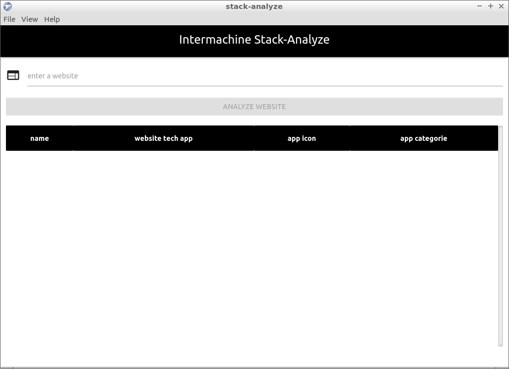
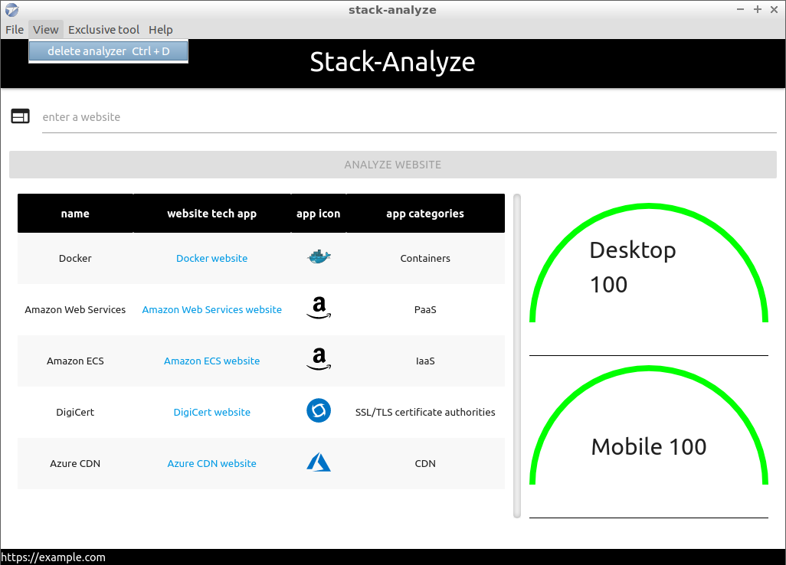
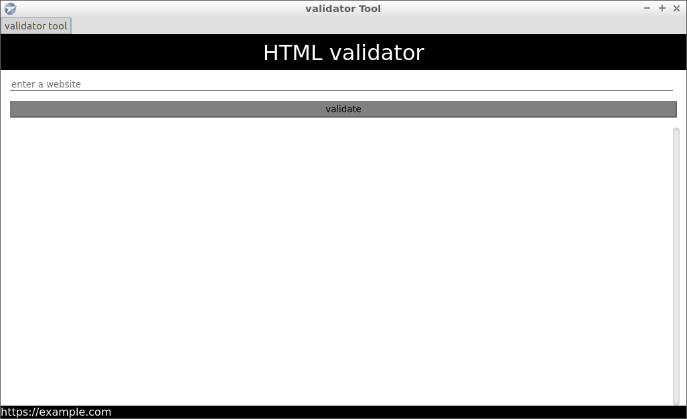
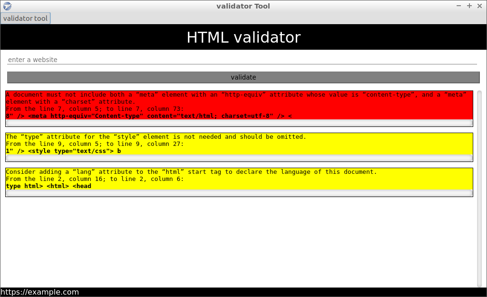

# stack-anlyze-desktop

GUI edition inspired of version 1.0.5 npm module stack-analyze for analyze tech stack and meta languaje website.

## screenshots
examples of start analyze

### start

### analyze website

### HTML validator start

### HTML validator finish

## CLI edition
[stack-analyze module](https://www.npmjs.com/package/stack-analyze) 
[module repo](https://github.com/intermachine-developers/stack-analyze)

**history version: **
[changelog](/changelog.md)

**system requeriments: **
[system requeriments](/requeriments.md)

**Main developer omega5300 _MIT license_**
